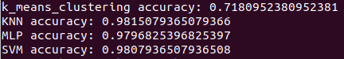
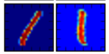
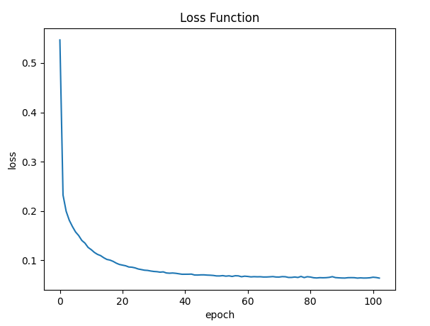
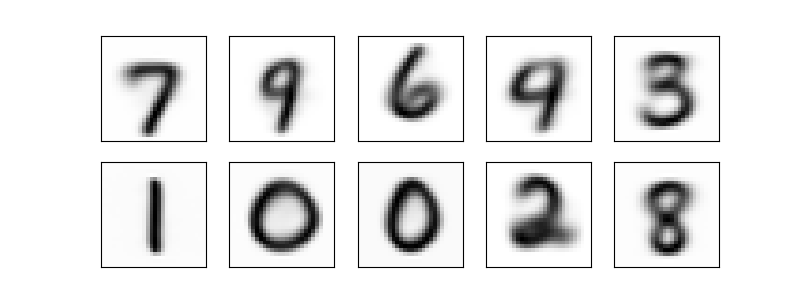
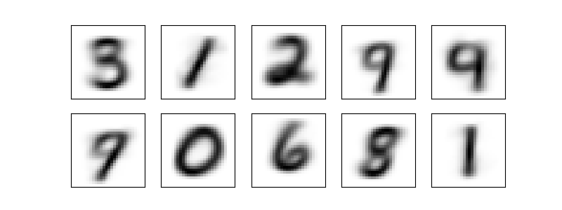

# Digit Recognition

This repository includes 4 machine learning implementation to recognize digit. 

## Submitters: 

Yishay Seroussi 305027948, Samuel Bismuth 342533064.

## Python version:

 3.9

## Dataset

The dataset [Digit Recognizer](https://www.kaggle.com/c/digit-recognizer/overview) contains 40,000 samples of 28x28 images each of which represent a handwritten numerical digit. Note: the dataset used is the "train.csv" which was partitioned into a training subset and a testing subset.

## Machine Learning Techniques

- KNN
- Neural Network
- SVM
- K-Means Clustering

## Configuration 

We use the docker environement. Make sure docker is installed in you machine. That is the only dependency of the project. 

According to your distribution, run:

    sudo <yum/apt-get> install -y docker

Then, to run all the techniques: 
    
    bash starts/start_all.sh 

To enter in the container terminal (only for developement purpose):

    bash starts/bash.sh 

Then, to run a specific technique: 
    
    bash starts/start_<technique>.sh 

If you don't want to use docker, you are able to run the code in any machine by folowing the next steps:

Install python3.9.

Install package by running:

    pip3 install -r requirement.txt

Run the main python file of your choice:

    python3 main.py

## Code structure:

The code is composed of four folders.

- The data folder containing the csv file of data.
- The packages folder containing the requirement txt file with the pip lib we used.
- The starts folder containing all the starter scripts.
- The src folder containing the code source.
    - main.py -> The main file of the code. This is our entrypoint. This is also the file were the prints are done.
    - data.py -> Here the data is build and split.
    - KNN folder with the KNN implementation
    - k_means_clustering folder with the k_means_clustering implementation
    - SVM folder with the SVM implementation
    - neural_network folder with the neural_network implementation

## Output



## Best Accuracies

- k_means_clustering accuracy: 0.7180952380952381
- KNN accuracy: 0.9815079365079366
- MLP accuracy: 0.9803174603174604
- SVM accuracy: 0.9807936507936508

## Data

The data is composed of handwritten digit images.
The data is splited into train and test with ratio of 30-70 respectively.
The first thing we want to execute on the data is deskewing.
The deskewing process will in fact improve our accuracy no matter the technique we are using: this is an universal improvement.
Here are the accuracies without deskewing the images:

- k_means_clustering accuracy: 0.5808503401360544
- KNN accuracy: 0.9580952380952381
- MLP accuracy: 0.931984126984127
- SVM accuracy: 0.9703968253968254

### What is Deskewing, why and how to do it?

One image equals 1000 words: <br>


When we write, we often write at angles to the paper, which cause letters and numbers to be skewed. Unfortunately, unlike the human eye, computers cannot easily find similarities between images that are transformations of each other. Thus, the process of deskewing.

Very formally, deskewing is the process of straightening an image that has been scanned or written crookedly — that is an image that is slanting too far in one direction, or one that is misaligned.

In particular, we model the process of deskewing as an affine transformation. We assume that when the image was created (the skewed version), it is actually some affine skew transformation on the image Image′=A(Image)+b

which we do not know. What we do know is that we want the center of mass to be the center of the image, and that we'd like to know the angle at which it was skewed.

The methodology goes as follows:

1) Find the center of mass of the image to figure out how much we need to offset the image
2) Find the covariance matrix of the image pixel intensities (we can use this to approximate the skew of the angle)

## Neural Network

The NN model used in this project is MLP.
A multilayer perceptron (MLP) is a class of feedforward artificial neural network. In this project the MLP consists of three layers of nodes. Except for the input nodes, each node is a neuron that uses a nonlinear activation function (tanh in our case). MLP using backpropagation technique for the training.
At the starting point we used one hidden layer of size=100, activation function=tanh, solver=adam, alpha=0.05, and adaptive learning rate.

### Hypertuning model parameters using GridSearchCV

Using GridSearchCV, our goal is to find the optimal values for the hidden layers size, activation function, optimizer, alpha, and the learning rate be constant or adaptive.
The best values for them are: activation: tanh, alpha: 0.05, hidden_layer_sizes: 100, learning_rate: adaptive, solver: adam.
Note: because of our limited time and the lack of power provided by our computers, we could only make a few parameter tests. Thus, we belive there are more efficient parameter that we couldn't find.

Loss function is shown in the next graph:<br>



## KNN

k-Nearest-Neighbors is a supervised machine learning model. Supervised learning is when a model learns from data that is already labeled. A supervised learning model takes in a set of input objects and output values. 

KNN models work by taking a data point and looking at the ‘k’ closest labeled data points. The data point is then assigned the label of the majority of the ‘k’ closest points.

For the sake of a starting point, we set the k parameter to be equal to 2.

```
n_neighbors = 2
```

Our simple KNN model without any tunning parameter reach an accuracy of 0.9778571428571429

### Hypertuning model parameters using GridSearchCV

Using GridSearchCV our goal is to find the optimal value for ‘n_neighbors’.
A dictionnary is created setting ‘n_neighbors’ as the key and using numpy to create an array of values from 1 to 20:

```
param_grid = {'n_neighbors': np.arange(1, 20)}
```

The best value for k appears to be 3, and this is actually verified in the accuracy results.

## SVM

Support-vector machine is a supervised machine learning model. SVM maps training examples to points in space so as to maximise the width of the gap between the categories, new examples are then mapped into that same space and predicted to belong to a category based on which side of the gap they fall.
At starting point we set the parameters: C=0.1, kernel=linear.

### Hypertuning model parameters using GridSearchCV

Using GridSearchCV, our goal is to find the optimal values kernel function, gamma, and C parameters.
The best values we found are: C: 0.1, gamma: 0.1, kernel: poly
Note: Again, as in MLP, because of our limited time and resources, we could only make a few parameter tests. Thus, we belive there are more efficient parameter that we couldn't find.

## K-Means clustering

In terms of evaluating accuracy. We should remember that k-means is not a classification tool, thus analyzing accuracy is not a very good idea. That the reason of the low accuracy result.
Actually, k-means is supposed to find a grouping of data which maximizes between-clusters distances, it does not use labels to train as you can see in the next line of code:

```
clusters = kmeans.fit_predict(train_x.tolist())
```

The impressive result we obtain with the k-means technique is shown in the next picture:


We see that even without the labels, KMeans is able to find clusters whose centers are recognizable digits, with perhaps the exception of 0 <-> 5 and 9 <-> 4.

Because k-means knows nothing about the identity of the cluster, the 0–9 labels may be permuted.
For the sake of classification, we are able to match each learned cluster label with the true labels found in them:

```
labels = np.zeros_like(clusters)
    for i in range(10):
        mask = (clusters == i)
        labels[mask] = mode(train_y[mask])[0]
```

And at the end, we reach an accuracy of 0.7180952380952381.
This accuracy is relatively less than other technique, and we can explain this by looking into the picture of the digits.
The digit 5 is recognize to be 0, and both digit 9 and 4 are really similar.

Interesting fact: A great improvement was acheived by deskewing the images. Notice that the improvement for the k-mean clustering method was much more significative. <br>
This is simply explained by the fact that all the learning of the k-means clustering is done on the images, without labellings. That is, improving the quality of the images has a really good side effect on the k-means learning. <br>
Here are the result without deskewing: <br>


You can see that the learning is weaker.

## Work division

We worked on this code together using one computer as a pair programming.
That is, we've handle and understand together the complexity of the digit recognition mahcine learning techniques implementation and the code design in python. There is nothing in this work that have been done only by one submitter.
Notice that we worked only on one github account since we used only one computer.